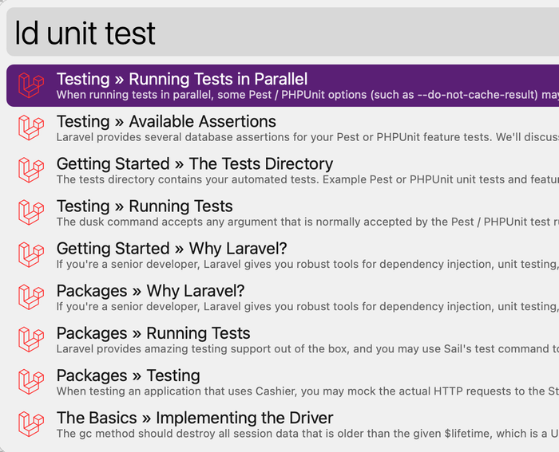

# Laravel Docs Workflow for Alfred

An ultra-fast Laravel docs search workflow for [Alfred 3+](https://www.alfredapp.com).



## Installation

1. [Download the latest version](https://github.com/tillkruss/alfred-laravel-docs/releases/download/v0.3.3/Laravel.Docs.alfredworkflow)
2. Install the workflow by double-clicking the `.alfredworkflow` file
3. You can add the workflow to a category, then click "Import" to finish importing. You'll now see the workflow listed in the left sidebar of your Workflows preferences pane.

## Usage

Just type `ld` followed by your search query.

```
ld <query>
ld preview mailables
```

Either press `⌘Y` to Quick Look the result, or press `<enter>` to open it in your web browser.

## Changing Branches

By default this workflow searches the `master` branch of the docs. However, you can change that to any branch listed on [laravel.com/docs](https://laravel.com/docs).

1. Go to the _Laravel Docs_ workflow in your Alfred preferences
2. Click the `[𝝌]` icon
3. Set the value of `branch` variable to your desired version (e.g. `9.x`)
